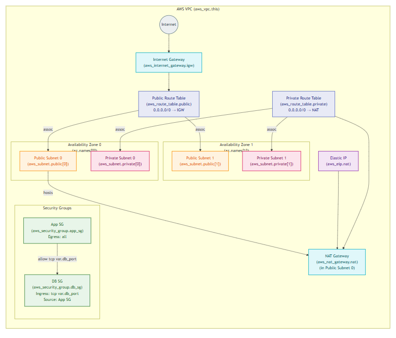
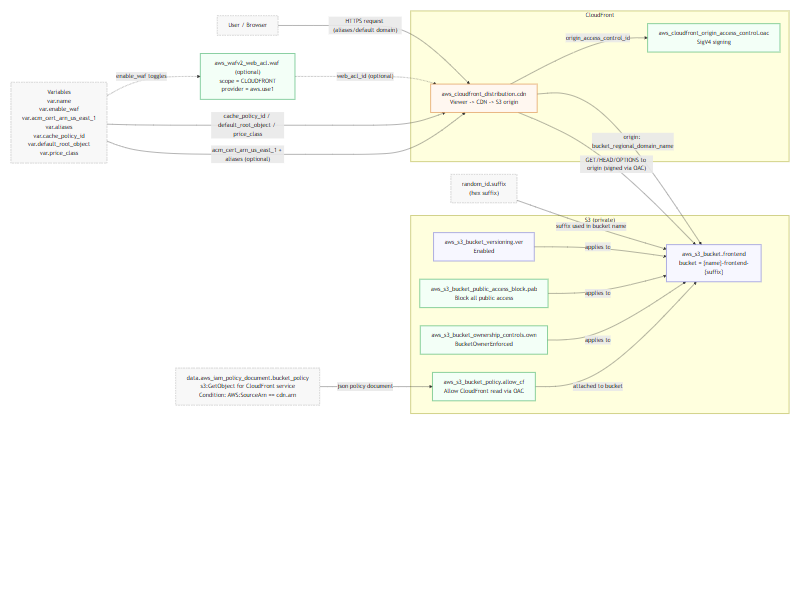
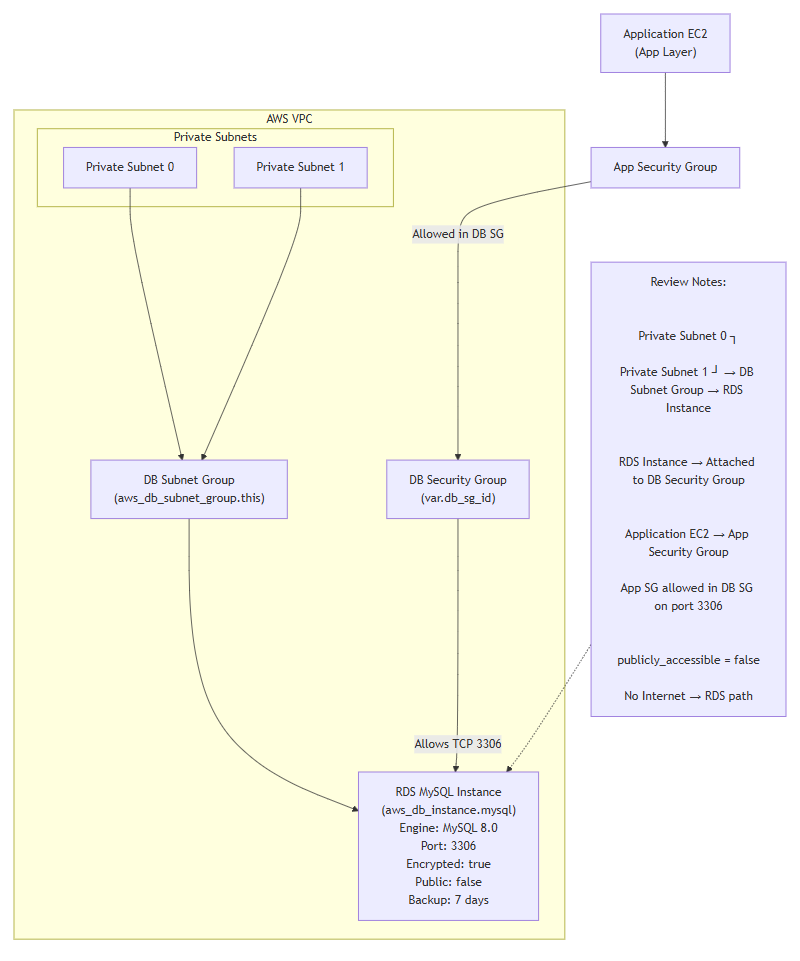

# AWS Multi-Tier Architecture (Terraform)

Production-grade AWS multi-tier infrastructure built with Terraform using a **bootstrap + environment separation** workflow.

This project implements a secure, modular, and environment-aware 3-tier architecture including:

- **Network Layer** (VPC, subnets, NAT, route tables, security groups)
- **Frontend Layer** (S3 + CloudFront + OAC)
- **Application Layer** (ALB + EC2 Auto Scaling)
- **Database Layer** (RDS MySQL in private subnets)

Designed to simulate real-world cloud architecture patterns used in production environments.

---

## 🏗 Architecture Overview

Each module includes its own rendered architecture diagram for clarity and modular documentation.

### Network Module

### Frontend Module

### API / Compute Module

### Database Module

---

## ✅ What This Repository Demonstrates

### Cloud Architecture
- Custom VPC with public and private subnets across multiple AZs  
- Internet Gateway + NAT Gateway for controlled outbound traffic  
- ALB distributing traffic to EC2 instances  
- RDS MySQL isolated in private subnets  
- S3 static frontend served through CloudFront CDN  

### Security Design
- Layered security boundaries (Public → Private → Database)  
- Security Groups enforcing:
  - ALB → EC2
  - EC2 → RDS
- No direct public access to application or database tier  
- NAT-only outbound access for private resources  

### High Availability
- Multi-AZ subnet design  
- ALB health checks  
- Decoupled tiers  
- CloudFront global edge caching  

### Cost Awareness
- Environment-based scaling (dev vs prod)  
- Modular design for resource right-sizing  
- NAT usage controlled  
- No unnecessary public exposure  

### Terraform Best Practices
- Remote state bootstrap phase  
- Separate `dev` and `prod` environments  
- Reusable modules  
- Clear input/output variables  
- Explicit dependency management  

---

## 🗂 Repository Structure
├─ bootstrap/ # Remote state + foundational resources
│ ├─ artifacts_bucket.tf
│ ├─ main.tf
│ ├─ outputs.tf
│ ├─ providers.tf
│ ├─ variables.tf
│ └─ versions.tf
│
├─ env/ # Environment-specific deployments
│ ├─ dev/
│ │ ├─ backend.hcl
│ │ ├─ backend.tf
│ │ ├─ main.tf
│ │ ├─ outputs.tf
│ │ ├─ providers.tf
│ │ ├─ terraform.tfvars
│ │ ├─ variables.tf
│ │ └─ versions.tf
│ │
│ └─ prod/
│ ├─ backend.hcl
│ ├─ backend.tf
│ ├─ main.tf
│ ├─ outputs.tf
│ ├─ providers.tf
│ ├─ terraform.tfvars
│ ├─ variables.tf
│ └─ versions.tf
│
└─ modules/ # Reusable infrastructure components
├─ network/
│ ├─ main.tf
│ ├─ variables.tf
│ ├─ outputs.tf
│ └─ chart.png
│
├─ frontend_s3_cf/
│ ├─ main.tf
│ ├─ variables.tf
│ ├─ outputs.tf
│ └─ chart.png
│
├─ api_ec2_alb/
│ ├─ main.tf
│ ├─ variables.tf
│ ├─ outputs.tf
│ └─ chart.png
│
└─ rds_mysql/
├─ main.tf
├─ variables.tf
├─ outputs.tf
└─ chart.png

---

## 🎯 Design Goals

- Clear separation of concerns  
- Environment isolation (dev/prod)  
- Reproducible infrastructure  
- Secure-by-default networking  
- Modular architecture ready for scaling  
- Documentation embedded alongside code  

---

## 🚀 Future Enhancements

- Multi-region failover architecture  
- CI/CD pipeline with CodePipeline  
- Blue/Green deployment strategy  
- WAF + enhanced security hardening  
- Automated diagram generation  

---

Built to reflect real-world AWS production architecture patterns.
